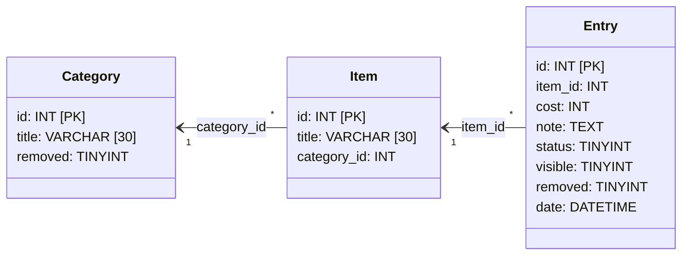

# Maintenance Tracker

Maintenance Tracker is an advanced to-do application that tracks the status of various items in a MySQL database. Values tracked include an item's category, title, status, repair cost, maintainer's note, and past updates.

The database structure is as follows:

